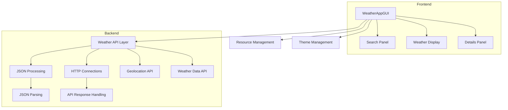
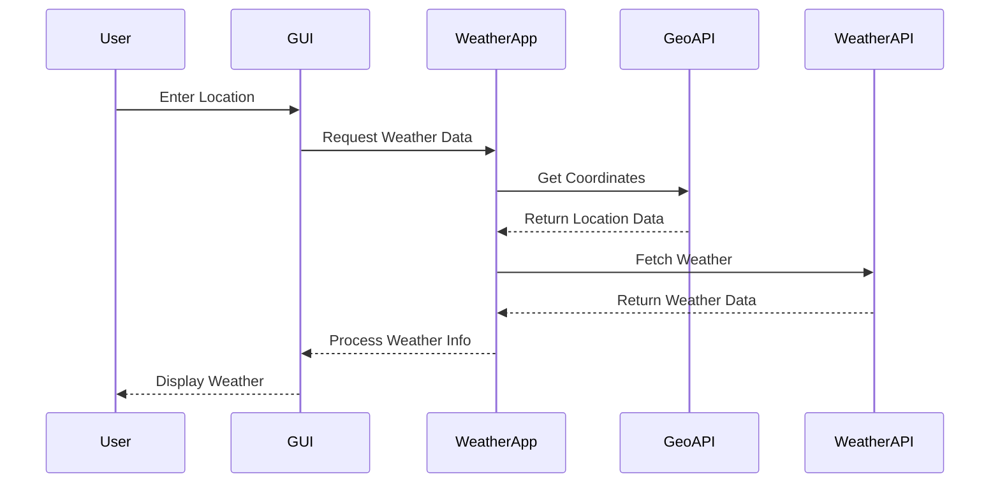
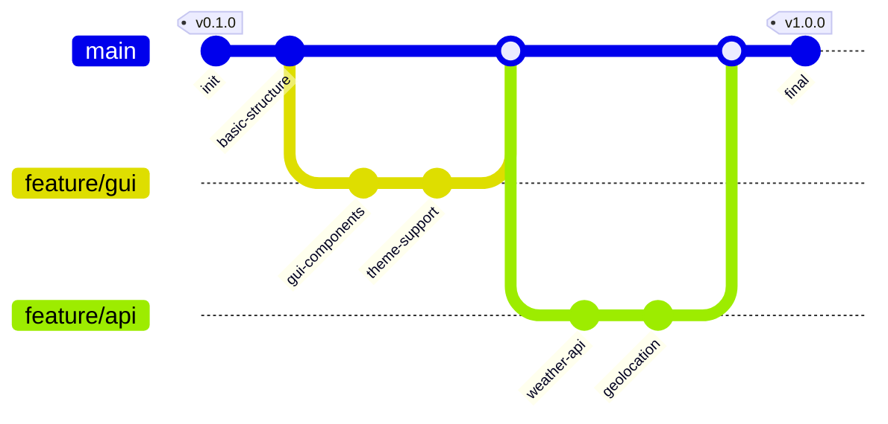
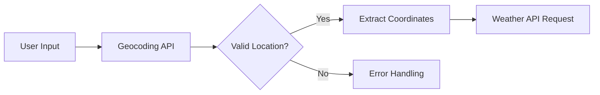

# Weather Project

*Add the Json-Jar file (source from net) to project structure
to the lib directory*

* Add the assets directory to src (contains img/asset)
* in the main dir, create the java class WeatherGUIApp

> ***NOTE:***  Super() method is used to call the constructor of the parent class

Jframe constructor can take parameter as String, for title.
Also, GraphicConfiguration class, and both.

* setDefaultCloseOperation() -> to end the process

EXIT_ON_CLOSE -> java. Swing constant to exit the application. (taken as parameter)

**setLocationRelativeTo()** -> Sets the
location of the window relative to the specified component ... Null can be used to place the window at center of screen.

A layout manager in Java Swing is an object that controls  the size and position of components within a container.

* Set Location, Layout of the gui.
* set the resizeable of gui, true or false based on your condition

> We will create the main() in AppLauncher class and display our GUI

**Async** -> it's a term associated with asynchronous programming, a paradigm where tasks can start
executing without waiting for previous one to finish.

**Runnable interface in Main method :**
*When we execute our app, it will call the run() which instantiates our gui and displays it*

## Adding some GUI Components

In the WeatherGUI, go and add some gui components

* JTextField will add a text box in the window
* customise the ui with the help of bound, font and fixes

**For adding a imageIcon button ->**  We can create a loadImage method of ImageIcon class.

* BufferImage class will help to manipulate the image content;
* create the "image", object with BufferImage class, and assign it to the value of source image destination
* ImagIO class will help to read and write to an image, .read() method will read the image from the source
* create the object of file class with new operator, and give the string value object assign to file object
* Return the image object of ImageIcon return type

### Weather Description Method

> **`SwingConstants`** - It's an interface that is a collection of constants which generally uses for positioning and orientation of swing components.

* Set bounds, fonts and alignment for this component.
* Font method -> **new** Font(name, style(font), size)-> Font class
* add the component

#### Add More GUI Components

Add Components such as Humidity identifier and Wind-speed using JLabel class of swing library and set their font and bounds.

## Weather API

### JSON

Import the JSON jar file to the project structure, which contains the org.json package, it has classes as JSONArray and
JSONObject.
which will help to parse the JSON data. We can store the JSON data as array through JSONArray class and as object
through JSONObject class.

To use weather forecast api we need to give the longitude and latitude data which can be found using their Geolocation
API,
that's why we will be creating another API call where it will take in and entered location, and returns the latitude and
longitude data

#### HTTPS Status Code

<h6> Level 200 </h6>
<ol>
<li>200 : OK</li>
<li>201 : Created</li>
<li>202: Accepted</li>
<li>203: Non-Authoritative Information</li>
<li>204: No Content</li>
</ol>

about the string Builder, scanner hasNext method, and explaining in detail about the
getLocationData method is necessary;

*JavaScript Format for different data Structure*

> Array, objects and json = [], {}, "{}";

The geolocation api will return us a list of different countries that have entered city,
so we are going to use the first's object data, hence we use get(0) in `location object` of JSONObject class in
getLocationData method.

<p> we can also see, that we can retrieve the values using the get ("json property"), we also have to cast type whenever we get a value from JSONObject</p>

> The get(key) method of JSONObject class will return the value to which the key is specified, and we can cast it to the
> required type.

# Weather Application

A modern Java-based weather application featuring a sleek GUI and real-time weather data fetching capabilities.

## Architecture Overview



## Application Flow



## Git Development History



## Project Structure

The application follows a modular architecture with clear separation of concerns:

### Core Components

1. **WeatherAppGUI** (Frontend)
    * Manages the user interface
    * Handles user interactions
    * Implements theme switching
    * Components:
        * Search Panel
        * Weather Display
        * Details Panel

2. **WeatherApp** (Backend)
    * Handles API communications
    * Processes weather data
    * Key methods:
        * `getWeatherData()`
        * `getLocationData()`
        * `fetchApiResponse()`

3. **ResourceChecker**
    * Validates required resources
    * Manages asset availability
    * Creates necessary directories

## API Integration

### Geolocation API Flow

1. User inputs location name
2. Application calls geolocation API
3. Receives coordinates (latitude/longitude)
4. Processes location data



### Weather Data Retrieval

1. Uses coordinates to fetch weather
2. Processes JSON response
3. Extracts relevant data:
    * Temperature
    * Weather condition
    * Humidity
    * Wind speed

## Technical Implementation Details

### HTTP Connection Handling

```java
private static HttpURLConnection fetchApiResponse(String URLString) {
    // Establishes connection to API endpoint
    // Returns HttpURLConnection object
}
```

### JSON Data Processing

* Uses `org.json.simple` library
* Parses API responses
* Extracts weather information

### GUI Components

1. **Search Panel**
    * Text field for location input
    * Search button with icon
    * Theme toggle button

2. **Weather Display**
    * Dynamic weather condition image
    * Temperature display
    * Weather description

3. **Details Panel**
    * Humidity information
    * Wind speed data
    * Styled with rounded corners

## Theme Management

The application supports two themes:

* Dark Theme (default)
* Light Theme

Theme switching affects:

* Background colors
* Text colors
* Component styling
* Icons and imagery

## Resource Management

Essential resources include:

* Weather icons
* Theme icons
* GUI assets

The `ResourceChecker` ensures all required assets are available before launch.

## Error Handling

The application implements robust error handling:

1. Network connection issues
2. Invalid location inputs
3. Missing resources
4. API response validation

## Getting Started

1. Add the JSON-JAR file to the project's lib directory
2. Ensure all assets are in the src/assets directory
3. Configure API keys if required
4. Build and run the application

## Development Notes

* Uses Swing for GUI components
* Implements asynchronous API calls
* Follows MVC pattern principles
* Maintains clean separation of concerns

## Dependencies

* Java Swing
* JSON Simple library
* FlatLaf for modern UI
* ImageIO for image processing

This weather application provides a modern, user-friendly interface while maintaining robust backend functionality for
accurate weather data retrieval and display.

> **Note:** Always ensure proper error handling and user feedback in network-dependent applications.
